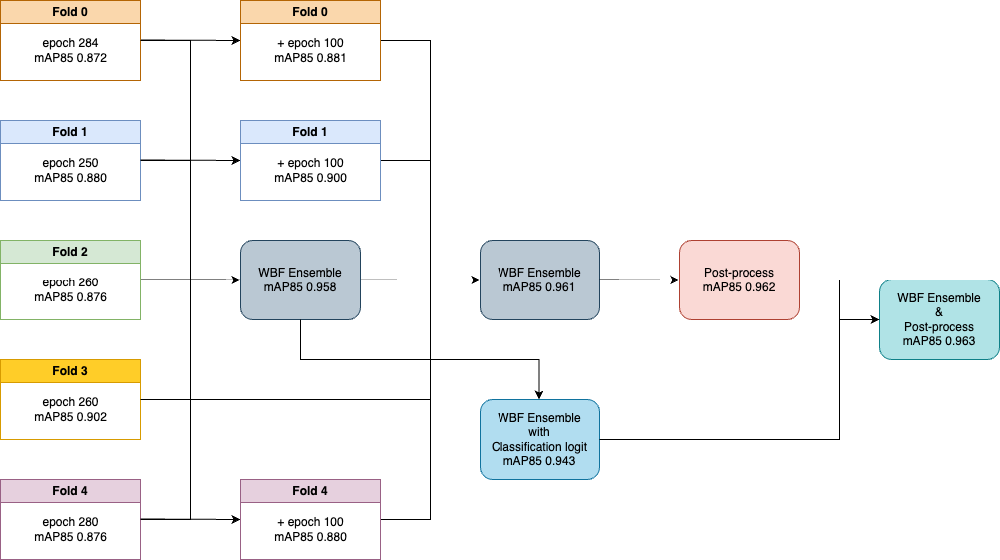

# object-detection-for-synthetic-data


## Overview
[합성데이터를 활용한 자동차 탐지 AI 모델 개발](https://dacon.io/competitions/official/236107/overview/description)
- **평가 방식**: 실제 도로 위의 자동차 탐지와 34개의 세부 모델 판별
- **결과**: *mAP85 0.96359 [Private 19th / 856 teams]*



- 사용한 모델: YOLOv8x, Cascade, ATSS, DINO
- Weighted-box Fusion 방식으로 Ensemble 적용

---

## Environments
- 실험 환경: Ubuntu 18.04, Cuda 11.3, Python 3.8.5

---

## YOLO Train

```shell
cd yolov8
python train.py
```

## YOLO Test

```shell
cd yolov8
python test.py
```

---

## MMdetection Train

```shell
cd mmdetection
python tools/train.py {config}
```

## MMdetection Test

```shell
cd mmdetection
python tools/test.py {config} {checkpoint} --out {pkl file name}
python utils/pkl2submission.py {pkl file path} {submission file path}
```
---

## Contributors🔥
| [백우열](https://github.com/wooyeolBaek) | [원준식](https://github.com/JSJSWON) | 
| :-: | :-: |
|  |  

---

## Reference
[YOLOv8](https://github.com/ultralytics/ultralytics)

[MMDetection](https://github.com/open-mmlab/mmdetection)

[Weighted-Boxes-Fusion](https://github.com/ZFTurbo/Weighted-Boxes-Fusion)

[Confusion Matrix](https://stages.ai/competitions/218/discussion/talk/post/1817)